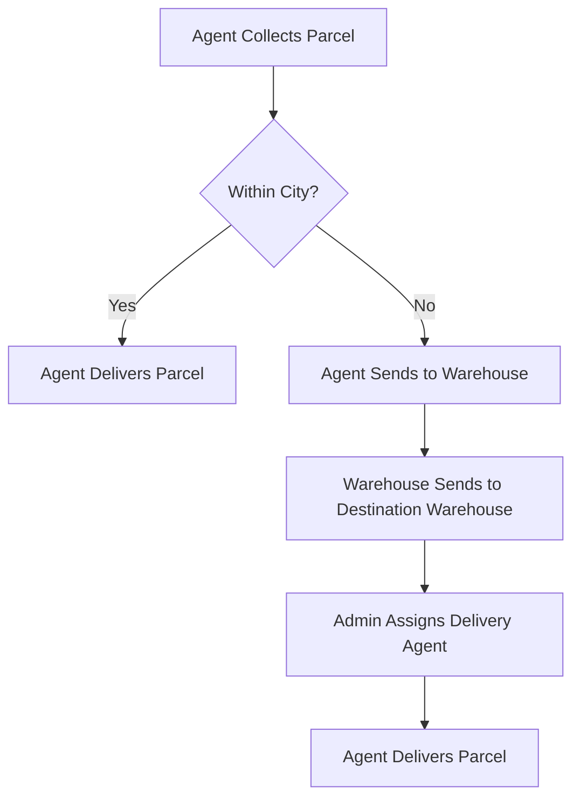

# 📦 Parcello

Welcome to **Parcello** –
A full-stack parcel management system featuring real-time tracking, secure delivery management, and role-based dashboards.

---

## 📊 System Overview

| Role               | Responsibilities                                                      | Benefits / Earnings                   |
| ------------------ | --------------------------------------------------------------------- | ------------------------------------- |
| **Merchant**       | • Book parcels• Pay charges• Track status• Leave reviews              | • Real-time tracking• Feedback system |
| **Admin**          | • Assign agents• Manage routing• Oversee warehouses• Monitor system   | • Full operational control            |
| **Delivery Agent** | • Collect & deliver parcels• Update status• OTP confirmation• Handoff | • Earn ৳20 per delivery               |

---

## 💰 Pricing Structure

| Parcel Type      | Weight         | Within City | Outside City/District |
| ---------------- | -------------- | ----------- | --------------------- |
| **Document**     | Any            | ৳60         | ৳80                   |
| **Non-Document** | Up to 3 kg     | ৳110        | ৳150                  |
| **Non-Document** | More than 3 kg | +৳40/kg     | +৳40/kg + ৳40 extra   |

---

## 🚛 Delivery Workflow



---

## 🔑 Key Features

* ✅ **Real-Time Parcel Tracking**
* 🔐 **OTP-Based Secure Delivery**
* ⚙️ **Automated Pricing Calculator**
* 🧭 **Role-Based Access Control**
* 🏢 **Admin-Controlled Logistics Flow**
* 🌐 **Nationwide Coverage (64 Districts)**
* 💸 **Transparent Commission System**

---

## 🛠️ Tech Stack

* **Frontend:** React.js, Tailwind CSS, DaisyUI
* **Backend:** Node.js, Express.js
* **Database:** MongoDB
* **Authentication:** JWT & Role-Based Auth
* **Visualization:** Chart.js, Mermaid.js

---

## 🚀 Getting Started

### Prerequisites

* Node.js & npm
* MongoDB instance (local or cloud)

### Installation

```bash
# Clone the repository
$ git clone https://github.com/md-zeon/Parcello.git
$ cd Parcello

# Install client dependencies
$ cd parcello-client
$ npm install

# Install server dependencies
$ cd ../parcello-server
$ npm install
```

### Running the App

```bash
# Start the server
$ cd parcello-server
$ npm run dev

# In another terminal, start the client
$ cd ../parcello-client
$ npm run dev
```

---

## 🌐 Live Demo

> Coming soon... 

---

## 📸 Screenshots

> Coming soon... 

---

## 📩 Contact

**Zeanur Rahaman Zeon**
📧 [zeon.cse@gmail.com](mailto:zeon.cse@gmail.com)
🌍 [Portfolio](https://zeon-portfolio.netlify.app) • [GitHub](https://github.com/md-zeon) • [LinkedIn](https://linkedin.com/in/zeanur-rahaman-zeon)

---

## 📄 License

This project is licensed under the [MIT License](LICENSE).
